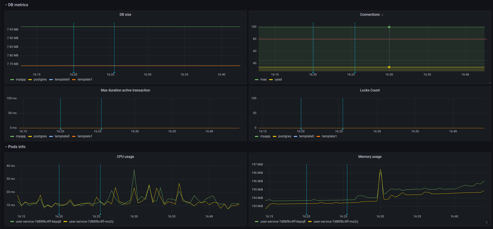

## ДЗ 03 - Prometheus. Grafana

### /user-service 

Используется user-service из ДЗ 02. Добавлены метрики прометея. Для тестирования используется эндпоинт, который с некоторой вероятностью прокидывает 500:

`GET /?errorFrequency=500` - выбор всех пользователей. С вероятностью 1 к 500 прокинется 500-ка

`GET /actuator/prometheus` - метрики для прометеуса

Образ запушен в dockerhub (`axelli/user-service:2.5`)

### /k8s

values для helm-чартов:
* ingress-nginx.yml - ингресс
* pg-values.yml - postgres экспортер
* prometheus.yml - prometheus-оператор
* /helm - чарты приложения user-service

---

### ДЗ

1. Сделать дашборд в графане, в котором были бы метрики с разбивкой по API методам (RPS, Latency, Error rate):
  

2. Добавить в дашборд графики с метрикам в целом по сервису, взятые с nginx-ingress-controller (RPS, Latency, Error rate):
   

3. Настроить алертинг в графане на Error Rate и Latency (сделано для метрик с nginx)
4. _Задание с *_ Добавить на дашборд графики с метриками 
   * Потребление подами приложения памяти
   * Потребление подами приложения CPU
   * Инструментировать базу данных с помощью экспортера для prometheus для этой БД. Добавить в общий дашборд графики с метриками работы БД.

   

P.S. Скрипт дашборда: https://github.com/Axelli/otus/tree/master/homework03/grafana/dashboard.json

### Для запуска
1. Корневая папка https://github.com/Axelli/otus/tree/master/homework03/k8s
2. Запустить скрипт `helm/run.sh`, чтобы поднять базу и приложение user-service 
3. Запустить скрипт `./run.sh`, чтобы поднять prometheus и nginx-ingress-controller
   1. Для доступа к админке прометея по http://localhost:9090 выполнить: `kubectl port-forward service/prom-kube-prometheus-stack-prometheus 9090`
   2. Для доступа к графане по http://localhost:9000 выполнить: `kubectl port-forward service/prom-grafana 9000:80`
      1. Логин/пароль к админке: 
         1. Логин: `kubectl get secret prom-grafana -o jsonpath='{.data.admin-user}' | base64 -d` -> `admin`
         2. Пароль: `kubectl get secret prom-grafana -o jsonpath='{.data.admin-password}' | base64 -d` -> `prom-operator`
   3. Чтобы посмотреть метрики postgres по http://localhost:9100/metrics , выполнить: `kubectl port-forward service/myapp-pg-prometheus-postgres-exporter 9100:80`
4. Провести нагрузочное тестирование можно с помощью скрипта: `while 1; do ab -n 50 -c 5 http://arch.homework/\?errorFrequency=500 ; sleep 3; done;`